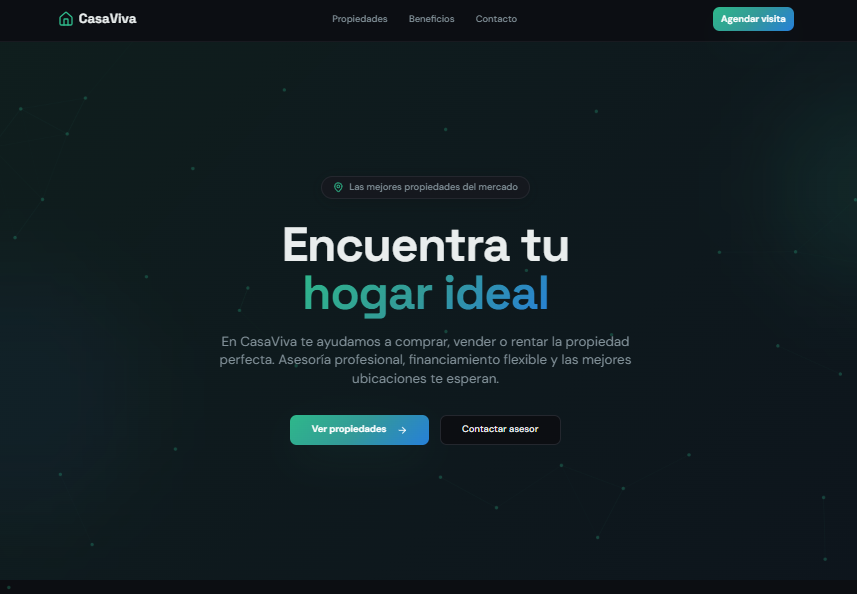
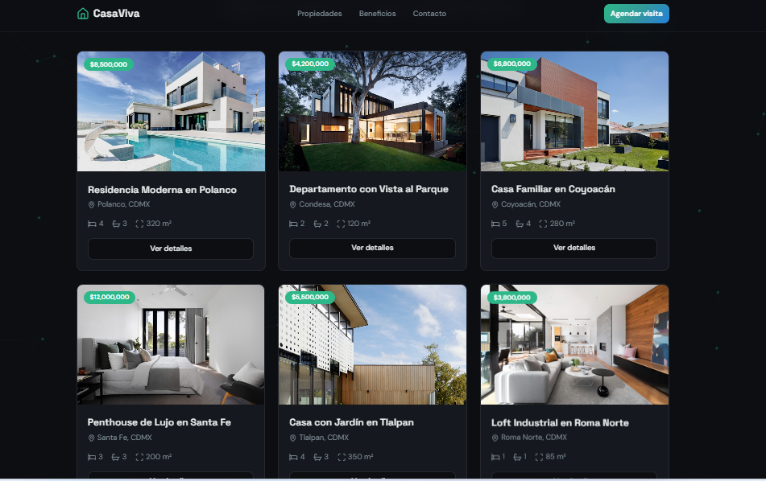
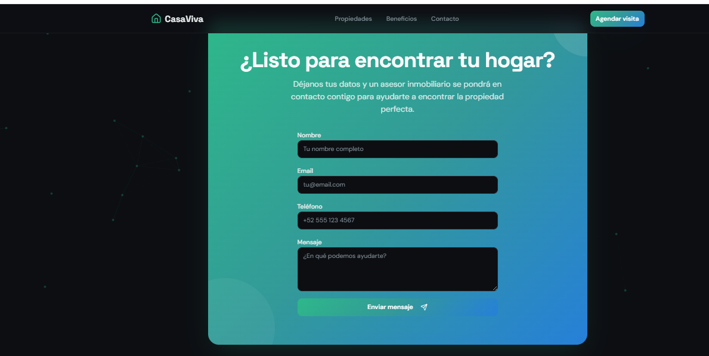

#Información general

Nombre del proyecto: Venta de Casas Modernas
Estudiante: Yefer Ortiz Hinestroza
Fecha: 28 Febrero 2026
Curso: Desarrollo Web

##Descripción del proyecto

Este proyecto consiste en una landing page interactiva para la venta de casas modernas, diseñada para promocionar propiedades de forma atractiva y profesional.

La página permite visualizar diferentes viviendas mediante una galería de imágenes, mostrar información relevante como precios y características, y cuenta con un formulario de contacto para que los usuarios interesados puedan comunicarse fácilmente.

El objetivo principal del proyecto es simular una plataforma inmobiliaria básica que facilite la promoción de casas en internet, utilizando un diseño moderno, responsivo y dinámico.

El sitio permite mostrar propiedades con imágenes, descripciones y un formulario de contacto para posibles compradores.

##Problema que soluciona

Facilita la promoción de viviendas en internet de forma visual y accesible.
Público objetivo

Personas interesadas en comprar vivienda

Inmobiliarias

Agentes de bienes raíces

##Tecnologías utilizadas

HTML

CSS

JavaScript

Bootstrap

Git

GitHub

##Descripción

index.html → Página principal del sitio

css/styles.css → Estilos visuales y diseño responsivo

js/script.js → Interactividad y funciones dinámicas

images/ → Imágenes de las casas y fondos

##Funcionalidades

Página principal con presentación del proyecto
Galería de casas con imágenes dinámicas
Fondo animado atractivo
Botones interactivos funcionales
Formulario de contacto para clientes
Diseño adaptable a celulares y tablets
Navegación fluida entre secciones

##Capturas de pantalla

![Galería]
![Formulario]

##¿Qué hace el proyecto?

Mi proyecto es una landing page interactiva para la venta de casas modernas.
Permite mostrar propiedades con imágenes, información básica y un formulario de contacto para que los usuarios interesados puedan comunicarse.

Su objetivo es promocionar viviendas de forma visual, organizada y accesible.

##¿Cómo funciona?

El sitio muestra una página principal con la presentación del proyecto.

###El usuario puede:

Ver las casas disponibles en la galería

Observar imágenes e información de cada propiedad

Navegar fácilmente por la página

Enviar sus datos mediante el formulario de contacto

El diseño es responsivo, por lo que funciona en celulares, tablets y computadoras.

##Utilicé:

React + Vite para la estructura y rendimiento del sitio

CSS para el diseño moderno y responsivo

JavaScript para la interactividad

HTML para la estructura base

Git y GitHub para el control de versiones y publicación

##¿Qué fue lo más difícil?

Lo más difícil fue entender la estructura del proyecto en React y organizar correctamente los componentes.

También fue un reto adaptar el diseño para que se viera bien en diferentes dispositivos.
y tambien al principio a subir el proyecto a Github, pero con la prasctica logre.

##Aprendí:

A crear interfaces modernas 

A diseñar páginas responsivas con  CSS

A organizar un proyecto profesionalmente

A usar GitHub para gestionar y publicar proyectos
##pajina:
Use the package manager [pajina](https://casa-viva.gt.tc/)) to install foobar.
